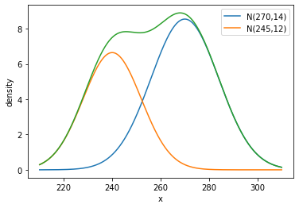

## 가우시안 혼합 모형(Gaussian Mixture Model) a.k.a GMM

어떤 학교에서 마음먹고 학생들의 발 사이즈를 모조리 전수조사 했다고 합시다. 그 데이터는 어떤 모양일까요?

일반적으로 남자는 여자보다 발이 큽니다. 그리고 발 사이즈는 우리가 잘 알고 있는 정규분포의 모양을 띄게 될 것입니다.

아래는 평균이 각각 270과 245, 표준편차가 각각 14와 12인 정규분포를 합한 결과입니다. 남자를 300명, 여자를 200명으로 가정하여 각각의 값에 300과 200을 곱하였습니다.


```python
import numpy as np
import matplotlib.pyplot as plt

x=np.arange(210,310,0.01)
def gaussian(x,mean,sigma):
  return (1/np.sqrt(2*np.pi*sigma**2)) * np.exp( -(x-mean)**2 / (2*sigma**2))

legend=[]
legend.append('N(270,14)')
legend.append('N(245,12)')

plt.plot(x,gaussian(x,270,14)*300)
plt.plot(x,gaussian(x,240,12)*200)
plt.plot(x,gaussian(x,270,14)*300+gaussian(x,240,12)*200)
plt.xlabel('x')
plt.ylabel('density')
plt.legend(legend)
plt.show()
```


    

    


두 이질 집단이 섞여있다고 가정하면 분포는 녹색 그래프처럼 보아뱀 모양을 나타내게 될 것입니다. 가우시안 혼합 모형(이하 GMM)은 하위집단의 개수를 파악하여 분류하는 분류 모형입니다.

하위집단이 정규분포를 따른다고 가정합시다. 그러면 각각의 하위집단은 평균과 표준편차를 파라미터로 가집니다. 그리고 남자 300명, 여자 200명 처럼 전체에서 그 집단이 차지하는 비율이 있습니다. 이렇게 각각의 하위집단은 평균, 표준편차, 비율이라는 세개의 파라미터를 가집니다. 각각을 𝜇, 𝜎, 𝜋 라고 둡시다. 
위의 예처럼 두 개의 하위집단인 경우, 두 집단의 파라미터는 각각 $$ ( 𝜇_1, 𝜎_1, 𝜋 _1)= (270, 14, \frac{3}{5} )$$ $$( 𝜇_2, 𝜎_2, 𝜋 _2)= (240, 12, \frac{2}{5} )  $$
입니다.


이를 바탕으로 확률변수 X의 확률밀도함수를 만들면 다음과 같습니다.
$$f(x) = \sum_c 𝜋_c N(x|𝜇_c, 𝜎_c ) $$

위 식에서 c는 집단의 인덱스를 의미하며 처음에 들었던 예에서는 남자와 여자 두개의 집단이 있으므로 1,2로 쓸 수 있습니다.
